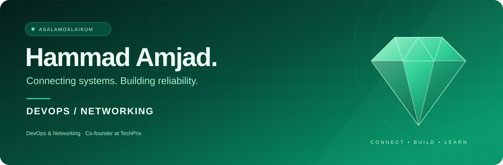
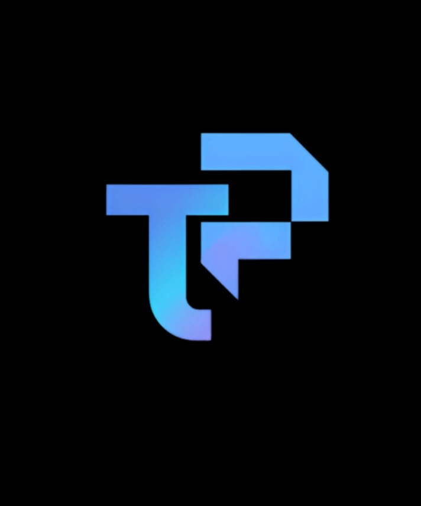
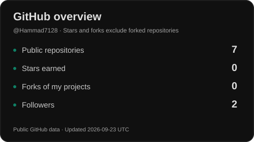
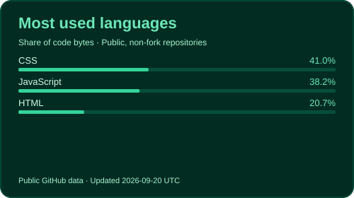

  

  
  
  
  

## A little about me

I'm Hammad, an Applied Computing student focused on **DevOps and networking**. I'm interested in how systems communicate, how applications are deployed, and what keeps services reliable.

I learn through hands-on practice: working through network configurations, troubleshooting connections, and exploring deployment workflows. My goal is to understand the infrastructure behind an application as well as the code that runs on it.

I'm also a **co-founder at [TechPrix](https://techprix.online)**.

## My toolkit

  
  
  
  

**What I enjoy:** frontend development · automation · UI/UX design · prototyping

## My work

| Project | What it's about | Explore |
| :--- | :--- | :--- |
| **Personal portfolio** | A home for my projects and learning journey. | [Visit website ↗](https://hammadamjad.netlify.app) · [Source code ↗](https://github.com/Hammad7128/protfolio) |

## Company

<table>
  <tr>
    <td width="140" align="center">
      
    </td>
    <td>
      <h3><a href="https://techprix.online">TechPrix</a></h3>
      
<strong>Co-founder</strong>

      <a href="https://techprix.online">Visit our company website ↗</a>
    </td>
  </tr>
</table>

## On my desk right now

- Strengthening my networking fundamentals through configuration and troubleshooting practice.
- Learning DevOps practices, including version control, CI/CD, and deployment workflows.
- Exploring how infrastructure and networking support reliable applications.

## GitHub overview

  
  

*Stats refresh automatically each day. The latest successful update date appears on each card. Languages reflect code in public, non-fork repositories—not my full skill set.*

[Repositories ↗](https://github.com/Hammad7128?tab=repositories) · [Pull requests ↗](https://github.com/pulls?q=is%3Apr+author%3AHammad7128) · [Contribution activity ↗](https://github.com/Hammad7128?tab=overview)

## Have something in mind?

I'm happy to connect about DevOps, networking, infrastructure, or a hands-on project we can learn from together.

**[Portfolio](https://hammadamjad.netlify.app)** &nbsp; / &nbsp; **[LinkedIn](https://www.linkedin.com/in/hammadamjad7128)** &nbsp; / &nbsp; **[Email](mailto:hammadamajd7128@gmail.com)**

